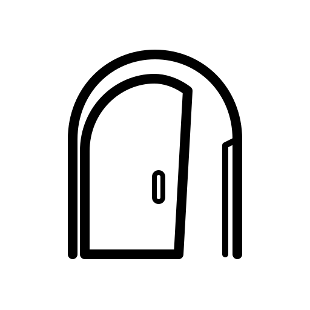
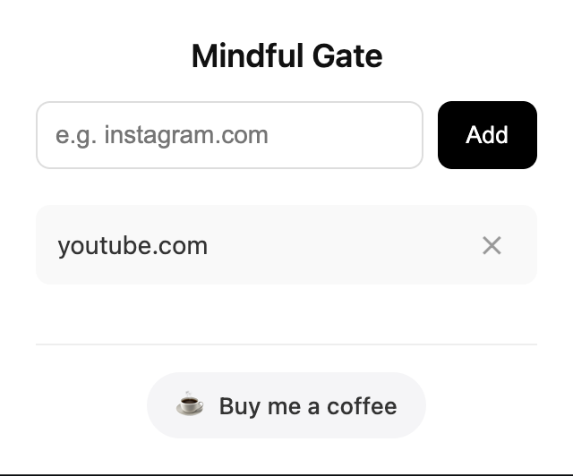
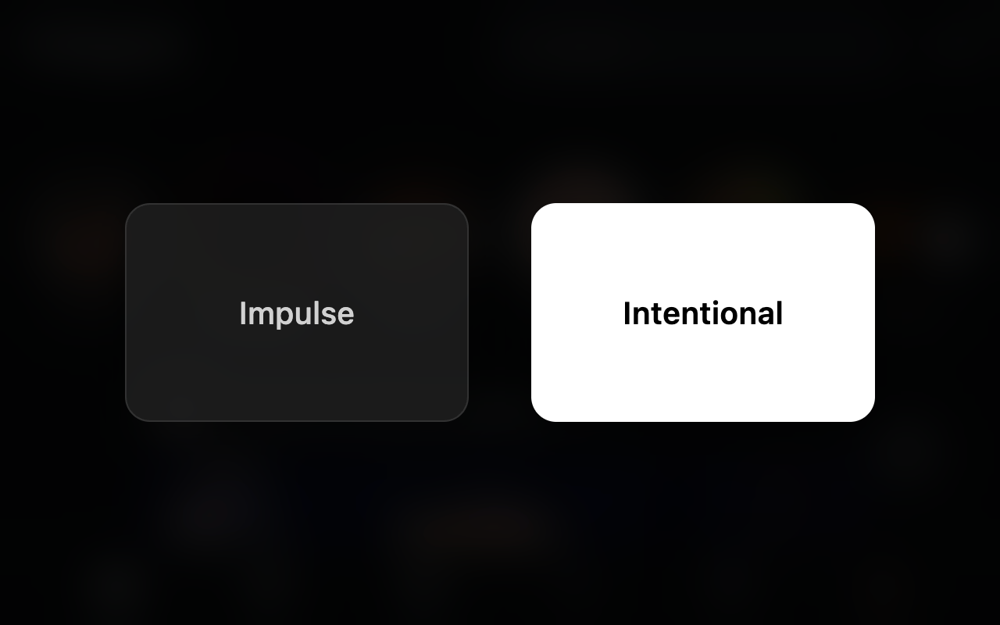

<div align="center">

  

  # MindfulGate 🧠
  
  **Turn mindless scrolling into mindful action.**
  
  A privacy-first Chrome Extension that breaks the dopamine loop of impulsive site-hopping.

  <a href="https://chromewebstore.google.com/detail/mindfulgate-mindful-brows/njjdhcpjolknliggmdlkdfondfinmkcp">
    
  </a>
  <a href="LICENSE">
    
  </a>
  
  

  <br />
  
  <a href="https://chromewebstore.google.com/detail/mindfulgate-mindful-brows/njjdhcpjolknliggmdlkdfondfinmkcp"><strong>📥 Install from Chrome Web Store</strong></a>
  ·
  <a href="#-local-development"><strong>💻 Run Locally</strong></a>
  ·
  <a href="https://github.com/anujaga2005/MindfulGate/issues"><strong>🐛 Report Bug</strong></a>

</div>

<br />

---

## 🧐 The Problem
We've all been there: You're watching a lecture or reading documentation, and suddenly—without thinking—your fingers type `instagram.com` or `youtube.com`. 

It's **"Autopilot Mode."** By the time you realize you've lost focus, you're already 10 minutes deep into a scroll session. Traditional blockers are too aggressive; they treat you like a child by just saying "NO."

## 💡 The Solution: MindfulGate
MindfulGate doesn't block you; it **interrupts the pattern**. 

When you visit a distracting site, it injects a beautiful, frosted-glass overlay that forces a **7-second pause**. It asks you one simple question:

> **"Is this impulsive or intentional?"**

This micro-friction is often all you need to snap out of the dopamine loop and get back to work.

---

## 📸 Screenshots

<div align="center"> 
  
</div>

<br />

| **The Popup (Config)** | **The "Gate" (Dark Mode)** |
|:---:|:---:|
|  |  |

---

## ✨ Key Features

* **🧘 Mindful Pause:** A non-intrusive "breathing room" overlay that intercepts distracting URLs.
* **🎨 Apple-Inspired Design:** Minimalist UI with frosted glass effects (backdrop-filter), system fonts, and native Dark Mode support.
* **🔒 Privacy First:** 100% Local Storage. No data is collected, no analytics, no external servers. Your browsing history stays on your device.
* **⚡ Ultra Lightweight:** Built with **Vanilla JavaScript** (no heavy frameworks). The content script executes in <50ms.
* **🚀 Modern Tech:** Fully compliant with Google's latest **Manifest V3** architecture.

---

## 🛠️ Tech Stack

* **Core:** HTML5, CSS3, JavaScript (ES6+)
* **Architecture:** Chrome Extension Manifest V3
* **Storage:** `chrome.storage.local` API
* **Styling:** CSS Variables, Flexbox, Backdrop Filters

---

## 💻 Local Development

If you want to tweak the code or contribute, follow these steps to run it locally:

1.  **Clone the repository**
    ```bash
    git clone [https://github.com/anujaga2005/MindfulGate.git](https://github.com/anujaga2005/MindfulGate.git)
    ```

2.  **Open Chrome Extensions**
    * Navigate to `chrome://extensions/`
    * Toggle **Developer mode** (top right corner).

3.  **Load Unpacked**
    * Click **"Load unpacked"**.
    * Select the folder where you cloned the repo.

4.  **Test it out**
    * Open the popup and add `instagram.com`.
    * Visit Instagram and see the Gate in action!

---

## 🤝 Contributing

Contributions are welcome! If you have ideas for new features (like a "Strict Mode" or "Stats Dashboard"), feel free to fork the repo and submit a PR.

1.  Fork the Project
2.  Create your Feature Branch (`git checkout -b feature/AmazingFeature`)
3.  Commit your Changes (`git commit -m 'Add some AmazingFeature'`)
4.  Push to the Branch (`git push origin feature/AmazingFeature`)
5.  Open a Pull Request

---

## ☕ Support the Project

If this extension helped you save a few hours of your life, consider buying me a coffee! It helps keep the updates coming.

<a href="https://www.buymeacoffee.com/anujaga2005" target="_blank">
  
</a>

---

## 📜 License

Distributed under the **MIT License**. See `LICENSE` for more information.

<div align="center">
  <br />
  Built with ❤️ by <a href="https://www.linkedin.com/in/anujaga/">Anuj</a>
</div>
